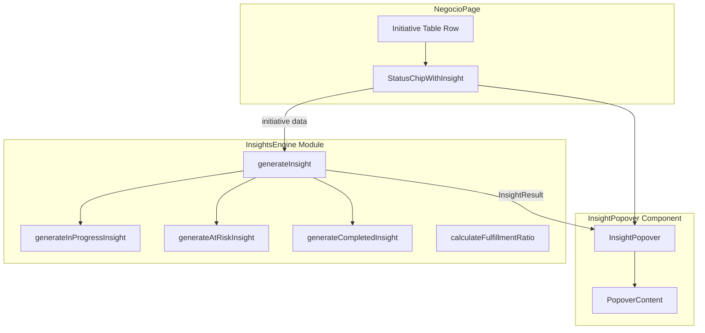

# Design Document: Initiative Status Insights

## Overview

Este diseño describe la implementación de tooltips/popovers interactivos sobre los chips de estado de iniciativas en la tabla del módulo Negocio. El sistema muestra insights contextuales (mejora continua, predicción de riesgo, resumen de éxito) al posicionar el cursor o enfocar un chip de estado.

La solución se divide en dos responsabilidades principales:
1. **InsightsEngine** — módulo de funciones puras que calcula insights a partir de datos de `Initiative`.
2. **InsightPopover** — componente React que gestiona la presentación, posicionamiento, hover/focus y accesibilidad del popover.

### Decisiones clave de diseño

| Decisión | Justificación |
|----------|---------------|
| Funciones puras en módulo separado | Facilita testeo con PBT, sin dependencias de React |
| Posicionamiento con cálculo manual de viewport | Evita dependencias externas (no se necesita Floating UI para un tooltip simple) |
| CSS Tailwind + sb-ui classes | Consistencia con el sistema de diseño existente |
| Portal rendering no necesario | El popover se posiciona absolute dentro de la celda de tabla |
| `fast-check` para property tests | Ya disponible en el proyecto (v3.19.0) |

## Architecture



### Flujo de datos

1. `NegocioPage` renderiza cada fila de la tabla con un `StatusChipWithInsight` wrapper.
2. Al hover/focus sobre el chip, el wrapper invoca `generateInsight(initiative)` del InsightsEngine.
3. El resultado (`InsightResult`) se pasa al `InsightPopover` que renderiza el contenido.
4. El popover calcula su posición relativa al chip usando `getBoundingClientRect()` y el viewport disponible.

## Components and Interfaces

### InsightsEngine (`src/pages/negocio/insights-engine.ts`)

Módulo TypeScript con funciones puras exportadas:

```typescript
// Función principal — punto de entrada del engine
export function generateInsight(initiative: Initiative): InsightResult;

// Cálculo del ratio de cumplimiento
export function calculateFulfillmentRatio(
  projectedValue: number, 
  actualValue: number
): number;

// Funciones internas (exportadas para testing)
export function generateInProgressInsight(initiative: Initiative, ratio: number): InsightResult;
export function generateAtRiskInsight(initiative: Initiative, ratio: number): InsightResult;
export function generateCompletedInsight(initiative: Initiative, ratio: number): InsightResult;
```

### InsightPopover (`src/pages/negocio/InsightPopover.tsx`)

Componente React que renderiza el popover:

```typescript
interface InsightPopoverProps {
  insight: InsightResult;
  isVisible: boolean;
  anchorRef: React.RefObject<HTMLElement>;
  popoverId: string;
}

export function InsightPopover(props: InsightPopoverProps): JSX.Element | null;
```

### StatusChipWithInsight (`src/pages/negocio/StatusChipWithInsight.tsx`)

Wrapper que integra el chip existente con el popover:

```typescript
interface StatusChipWithInsightProps {
  initiative: Initiative;
  chipClass: string;
  label: string;
}

export function StatusChipWithInsight(props: StatusChipWithInsightProps): JSX.Element;
```

### Hook de posicionamiento (`usePopoverPosition`)

Hook custom interno dentro de `InsightPopover.tsx`:

```typescript
function usePopoverPosition(
  anchorRef: React.RefObject<HTMLElement>,
  popoverRef: React.RefObject<HTMLElement>,
  isVisible: boolean
): { top: number; left: number; placement: 'top' | 'bottom' };
```

## Data Models

### Tipos del InsightsEngine

```typescript
/** Tipo de insight según el estado de la iniciativa */
export type InsightType = "improvement" | "risk_prediction" | "success_summary";

/** Métrica individual dentro del insight */
export interface InsightMetric {
  label: string;
  value: string;
}

/** Resultado completo del engine de insights */
export interface InsightResult {
  type: InsightType;
  title: string;
  description: string;
  metrics: InsightMetric[];
  recommendation: string;
}

/** Mapeo de status a tipo de insight */
export const STATUS_TO_INSIGHT_TYPE: Record<Initiative["status"], InsightType> = {
  en_progreso: "improvement",
  en_riesgo: "risk_prediction",
  completada: "success_summary",
};
```

### Relación con tipos existentes

El `InsightsEngine` consume directamente la interfaz `Initiative` definida en `src/types/index.ts`:

```typescript
interface Initiative {
  id: string;
  name: string;
  teamId: string;
  projectedValue: number;
  actualValue: number;
  status: "en_progreso" | "completada" | "en_riesgo";
}
```

No se requieren cambios a los tipos existentes ni al data-service.


## Correctness Properties

*A property is a characteristic or behavior that should hold true across all valid executions of a system — essentially, a formal statement about what the system should do. Properties serve as the bridge between human-readable specifications and machine-verifiable correctness guarantees.*

### Property 1: Status-to-insight-type consistency

*For any* valid Initiative, calling `generateInsight` SHALL produce an InsightResult whose `type` field equals `STATUS_TO_INSIGHT_TYPE[initiative.status]` and whose `title` matches the expected title for that status ("Mejora Continua" for en_progreso, "Predicción de Riesgo" for en_riesgo, "Resumen de Éxito" for completada).

**Validates: Requirements 2.1, 3.1, 4.1, 5.4, 5.5**

### Property 2: Fulfillment ratio formula correctness

*For any* pair of non-negative numbers (projectedValue, actualValue), `calculateFulfillmentRatio` SHALL return `(actualValue / projectedValue) * 100` when projectedValue > 0, and SHALL return 0 when projectedValue equals 0.

**Validates: Requirements 5.2**

### Property 3: Structural completeness of InsightResult

*For any* valid Initiative, `generateInsight` SHALL return an InsightResult with all fields populated: `title` is a non-empty string, `description` is a non-empty string, `metrics` is a non-empty array where each element has non-empty `label` and `value`, and `recommendation` is a non-empty string.

**Validates: Requirements 5.3**

### Property 4: In-progress threshold-based suggestions

*For any* Initiative with status "en_progreso" and projectedValue > 0, the generated insight's description SHALL match the fulfillment ratio threshold: ratio >= 90% produces the "camino óptimo" message, ratio in [70, 89] produces the "brecha moderada" message, and ratio < 70% produces the "brecha significativa" message.

**Validates: Requirements 2.2, 2.3, 2.4**

### Property 5: At-risk threshold-based diagnosis

*For any* Initiative with status "en_riesgo" and projectedValue > 0, the generated insight's description SHALL match the fulfillment ratio threshold: ratio < 50% produces "Desviación crítica de valor", and ratio in [50, 69] produces "Entrega de valor por debajo del objetivo". The insight SHALL also include the value gap (projectedValue - actualValue) formatted as currency in the metrics.

**Validates: Requirements 3.2, 3.3, 3.4, 3.5**

### Property 6: Completed success/shortfall message

*For any* Initiative with status "completada" and projectedValue > 0, when actualValue >= projectedValue the insight description SHALL indicate that expectations were met or exceeded, and when actualValue < projectedValue the description SHALL indicate the achieved percentage and suggest documenting lessons learned.

**Validates: Requirements 4.3, 4.4**

### Property 7: Fulfillment ratio formatting in metrics

*For any* Initiative with projectedValue > 0, the generated insight's metrics array SHALL contain an entry with label "Cumplimiento actual:" (or equivalent) whose value matches the pattern of a number with exactly one decimal place followed by "%" (e.g., "81.7%").

**Validates: Requirements 2.5, 4.2**

## Error Handling

### Casos de borde

| Caso | Comportamiento |
|------|---------------|
| `projectedValue === 0` (en_progreso) | Muestra mensaje "No es posible calcular el ratio de cumplimiento debido a un valor proyectado no definido" |
| `projectedValue === 0` (en_riesgo) | Muestra riesgo genérico "Datos insuficientes para predicción" con recomendación de actualizar valores |
| `projectedValue === 0` (completada) | Muestra el valor entregado sin ratio de cumplimiento |
| Status no reconocido | TypeScript previene esto en compilación; en runtime, fallback a un insight genérico vacío |
| Valores negativos | El engine trata valores negativos como 0 para el cálculo del ratio (defensive coding) |

### Estrategia de errores en el popover

- Si `generateInsight` lanza una excepción inesperada, el popover NO se muestra (fail silently, no crash de UI).
- El componente `StatusChipWithInsight` usa un try/catch alrededor de `generateInsight` y simplemente no renderiza el popover en caso de error.
- Los errores se loguean a console.warn en desarrollo para facilitar debugging.

## Testing Strategy

### Enfoque dual

1. **Property-based tests** (fast-check, 100+ iteraciones):
   - Verifican las 7 propiedades de correctness del InsightsEngine
   - Cubren todo el espacio de inputs válidos (diferentes ratios, status, edge cases)
   - Ubicación: `src/pages/negocio/__tests__/insights-engine.property.test.ts`

2. **Unit tests** (vitest, ejemplos específicos):
   - Verifican el formato exacto de mensajes con datos concretos
   - Verifican los edge cases de projectedValue = 0
   - Testing de componente React para hover/focus/keyboard
   - Ubicación: `src/pages/negocio/__tests__/insights-engine.test.ts` y `InsightPopover.test.tsx`

### Configuración de property tests

- Librería: `fast-check` (v3.19.0, ya instalada)
- Mínimo: 100 iteraciones por property
- Tagging: `Feature: initiative-status-insights, Property {N}: {title}`
- Generadores custom para `Initiative` con constraints por status

### Tests de componente (ejemplo)

- Simular hover → verificar que popover aparece con contenido correcto
- Simular Escape → verificar cierre
- Verificar atributos ARIA (role="tooltip", aria-describedby)
- Verificar posicionamiento no se sale del viewport

### Lo que NO se testea con PBT

- Timing de animaciones (200ms/300ms) — se verifica con tests de componente
- Estilos CSS y clases — se verifica con snapshot o smoke tests
- Posicionamiento del popover — depende del DOM/viewport, test de integración

