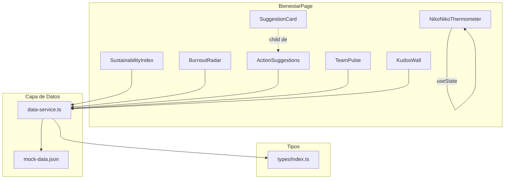
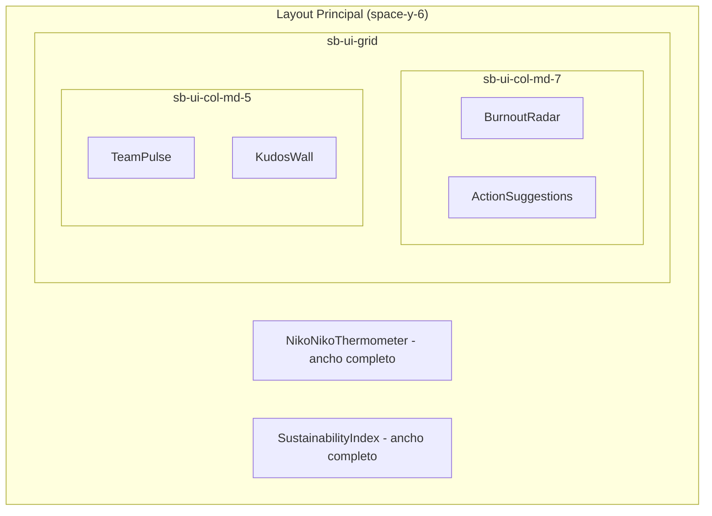
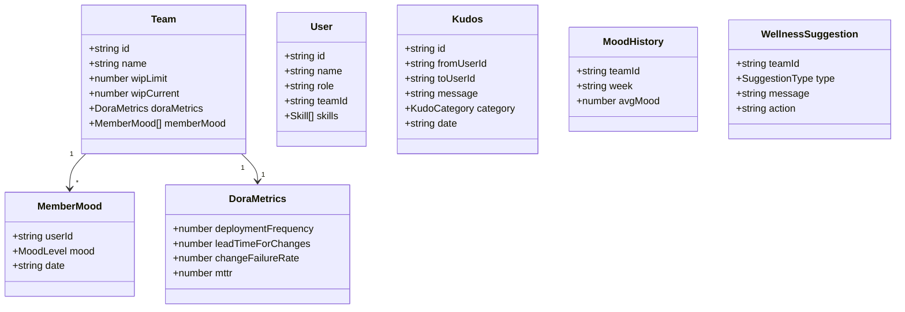

# Documento de Diseño — Módulo de Bienestar

## Resumen

El Módulo de Bienestar es una página React single-file que se renderiza en `/bienestar` dentro del dashboard de ingeniería. Proporciona una vista consolidada del estado emocional y carga de trabajo de las células de desarrollo, combinando detección de riesgos de burnout, reconocimiento entre pares, tendencias de ánimo y sugerencias accionables basadas en IA.

El módulo opera exclusivamente con datos mock sincronizados desde `data-service.ts`, sin llamadas HTTP ni estado global. Todos los componentes están contenidos en un único archivo `BienestarPage.tsx` con estado local vía `useState`.

## Arquitectura

### Diagrama de Componentes



### Diagrama de Layout



### Decisiones Arquitectónicas

| Decisión | Justificación |
|----------|---------------|
| Componentes en un solo archivo | Módulo autocontenido, sin dependencias cruzadas con otros módulos. Simplifica mantenimiento y reduce imports. |
| Estado local con `useState` | Solo el termómetro Niko-Niko tiene estado interactivo (selección de mood). No hay necesidad de estado global. |
| Datos sincrónicos | Mock data se carga como import estático. No hay latencia ni estados de loading. |
| Funciones puras de cálculo | `calculateHealthScore`, `getAverageMood`, `isAtBurnoutRisk` son funciones puras extraíbles y testeables. |
| Layout sb-ui-grid 7/5 | División visual que prioriza alertas/acciones (izquierda) sobre reconocimiento/tendencias (derecha). |

## Componentes e Interfaces

### Componentes

| Componente | Responsabilidad | Datos Consumidos | Estado |
|---|---|---|---|
| `NikoNikoThermometer` | Selección de mood del usuario | Ninguno (constantes internas) | `selectedMood: string \| null` |
| `SustainabilityIndex` | Health score compuesto por célula | `getTeams()` | Sin estado |
| `BurnoutRadar` | Alertas de riesgo de burnout | `getTeams()` | Sin estado |
| `ActionSuggestions` | Sugerencias IA categorizadas | `getWellnessSuggestions()`, `getTeams()` | Sin estado |
| `TeamPulse` | Tendencia semanal de ánimo | `getTeams()`, `getMoodHistoryByTeam()` | Sin estado |
| `KudosWall` | Feed de reconocimientos | `getKudos()`, `getUsers()` | Sin estado |
| `SuggestionCard` | Tarjeta individual de sugerencia | Props: `suggestion`, `teamName` | Sin estado |

### Funciones Utilitarias (puras)

| Función | Firma | Descripción |
|---|---|---|
| `getAverageMood` | `(team: Team) => number` | Calcula media aritmética del ánimo con mapeo numérico |
| `calculateHealthScore` | `(team: Team) => number` | Score compuesto 0-100 basado en ánimo, WIP y DORA |
| `isAtBurnoutRisk` | `(team: Team) => boolean` | `wipCurrent > wipLimit AND avgMood < 3` |
| `getScoreColor` | `(score: number) => string` | Clase CSS de color según umbral |
| `getScoreBg` | `(score: number) => string` | Clase CSS de fondo según umbral |
| `getScoreLabel` | `(score: number) => string` | Etiqueta textual del score |
| `getCategoryEmoji` | `(category: Kudos["category"]) => string` | Mapeo categoría → emoji |
| `getUserName` | `(userId: string, users: User[]) => string` | Resolución de nombre por ID |

### Interfaces de Props

```typescript
// SuggestionCard
interface SuggestionCardProps {
  suggestion: WellnessSuggestion;
  teamName: string;
}

// MoodOption (tipo interno)
type MoodOption = {
  emoji: string;
  label: string;
  value: "excelente" | "neutral" | "bajo";
};
```

## Modelo de Datos

### Tipos Consumidos (de `types/index.ts`)



### Constantes de Dominio

```typescript
const MOOD_SCORE: Record<string, number> = {
  excelente: 5,
  bien: 4,
  neutral: 3,
  bajo: 2,
  critico: 1,
};

const MOOD_OPTIONS: MoodOption[] = [
  { emoji: "😃", label: "Me siento genial", value: "excelente" },
  { emoji: "😐", label: "Normal", value: "neutral" },
  { emoji: "😫", label: "Agotado", value: "bajo" },
];
```

### Algoritmos Clave

#### Cálculo de Ánimo Promedio

```
getAverageMood(team):
  if team.memberMood is empty → return 3
  total = sum(MOOD_SCORE[member.mood] for each member)
  return total / count(members)
```

#### Health Score (0-100)

```
calculateHealthScore(team):
  moodScore = (avgMood / 5) × 40           // 40% peso
  wipRatio = min(wipCurrent / wipLimit, 2)
  wipScore = (1 - (wipRatio - 1) / 1) × 30  // 30% peso, penaliza exceso
  doraScore = (min(deployFreq, 15) / 15) × 15 
            + (1 - min(changeFailRate, 30) / 30) × 15  // 30% peso
  return clamp(round(moodScore + wipScore + doraScore), 0, 100)
```

#### Detección de Burnout

```
isAtBurnoutRisk(team):
  return team.wipCurrent > team.wipLimit AND getAverageMood(team) < 3
```


## Propiedades de Correctitud

*Una propiedad es una característica o comportamiento que debe mantenerse verdadero en todas las ejecuciones válidas de un sistema — esencialmente, una declaración formal sobre lo que el sistema debe hacer. Las propiedades sirven como puente entre especificaciones legibles para humanos y garantías de correctitud verificables por máquina.*

### Propiedad 1: Invariante de detección de burnout

*Para toda* célula C con valores válidos de `wipCurrent`, `wipLimit` y `memberMood`, `isAtBurnoutRisk(C)` retorna `true` si y solo si `C.wipCurrent > C.wipLimit` Y `getAverageMood(C) < 3`. Ninguna otra combinación de condiciones debe producir un resultado positivo.

**Valida: Requisito 2.1**

### Propiedad 2: Health score acotado

*Para toda* célula C con valores válidos (mood en [1,5], wipCurrent ≥ 0, wipLimit > 0, deploymentFrequency ≥ 0, changeFailureRate en [0,100]), `calculateHealthScore(C)` retorna un entero en el rango [0, 100].

**Valida: Requisito 5.1**

### Propiedad 3: Clasificación consistente del score

*Para todo* score s en [0, 100]:
- Si s ≥ 75 → `getScoreLabel(s)` = "Saludable" Y `getScoreColor(s)` contiene "green" Y `getScoreBg(s)` contiene "green"
- Si 50 ≤ s < 75 → `getScoreLabel(s)` = "Atención" Y `getScoreColor(s)` contiene "yellow" Y `getScoreBg(s)` contiene "yellow"
- Si s < 50 → `getScoreLabel(s)` = "Crítico" Y `getScoreColor(s)` contiene "red" Y `getScoreBg(s)` contiene "red"

Las tres funciones siempre clasifican de manera coherente entre sí.

**Valida: Requisitos 5.2, 5.3**

### Propiedad 4: Ánimo promedio metamórfica

*Para toda* célula C cuyo `getAverageMood(C) > 1`, si se agrega un miembro con mood="critico" (valor 1), el nuevo ánimo promedio debe ser estrictamente menor que el anterior.

**Valida: Requisito 5.1 (componente de ánimo del health score)**

### Propiedad 5: Color de barras por umbral de ánimo

*Para todo* valor de `avgMood` en el rango [0, 5]:
- Si avgMood ≥ 4 → color es "bg-green-400"
- Si 3 ≤ avgMood < 4 → color es "bg-yellow-400"
- Si avgMood < 3 → color es "bg-red-400"

La clasificación es exhaustiva y mutuamente excluyente.

**Valida: Requisito 4.2**

### Propiedad 6: Dirección de tendencia

*Para todo* par de valores `latest` y `previous` de avgMood, la tendencia (latest - previous) es ≥ 0 si y solo si se muestra flecha ascendente (verde), y < 0 si y solo si se muestra flecha descendente (roja).

**Valida: Requisitos 4.3, 4.4**

## Manejo de Errores

| Escenario | Comportamiento |
|---|---|
| `memberMood` vacío | `getAverageMood` retorna 3 (valor neutral por defecto) |
| `wipLimit` = 0 | `calculateHealthScore` divide por 0 en wipRatio → producirá Infinity. Mitigado por `Math.min(..., 2)` que limita el ratio |
| `userId` no encontrado | `getUserName` retorna "Usuario" como fallback |
| `moodHistory` vacía para un equipo | `TeamPulse` usa 0 como valor por defecto para latest/previous |
| Categoría de kudo inválida | No manejado actualmente — el tipo TypeScript previene categorías inválidas en compile-time |

### Consideraciones de Robustez

- No se implementan boundaries para `wipLimit = 0` en runtime (se confía en la validación de datos mock)
- No hay manejo de errores async (no hay operaciones async)
- El componente no implementa Error Boundaries — un error en un subcomponente tumba toda la página

## Estrategia de Testing

### Testing Unitario (Vitest + React Testing Library)

Tests de ejemplo para:
- Renderizado de cada componente con datos mock conocidos
- Interacción del Niko-Niko (click → selección → confirmación)
- Presencia de elementos de accesibilidad (`role="alert"`)
- Resolución de nombres de usuario (getUserName con IDs válidos e inválidos)
- Mapeo exhaustivo de categorías a emojis (getCategoryEmoji)
- Layout correcto (orden de componentes, clases sb-ui-grid)

### Testing Basado en Propiedades (Vitest + fast-check)

Se usará `fast-check` como librería de PBT. Cada propiedad se ejecutará con mínimo 100 iteraciones.

| Propiedad | Generadores Necesarios |
|---|---|
| P1: Burnout detection | Generador de `Team` con `wipCurrent` [0,20], `wipLimit` [1,10], `memberMood` con moods aleatorios |
| P2: Health score acotado | Generador de `Team` con DoraMetrics aleatorias dentro de rangos razonables |
| P3: Score classification | Generador de enteros [0, 100] |
| P4: Mood metamórfica | Generador de `Team` con memberMood no vacío y avgMood > 1 |
| P5: Bar color | Generador de floats [0, 5] |
| P6: Trend direction | Generador de pares de floats [0, 5] |

**Formato de tags en tests:**
```typescript
// Feature: modulo-bienestar, Property 1: Burnout detection invariant
// Feature: modulo-bienestar, Property 2: Health score bounded
```

### Configuración

- Framework: Vitest 3.x con `@testing-library/react` 16.x
- PBT: `fast-check` (librería aprobada para PBT en ecosistema JS/TS)
- Mínimo 100 iteraciones por propiedad (`fc.assert(property, { numRuns: 100 })`)
- Cobertura objetivo: 80% en funciones de lógica de negocio (`getAverageMood`, `calculateHealthScore`, `isAtBurnoutRisk`)
