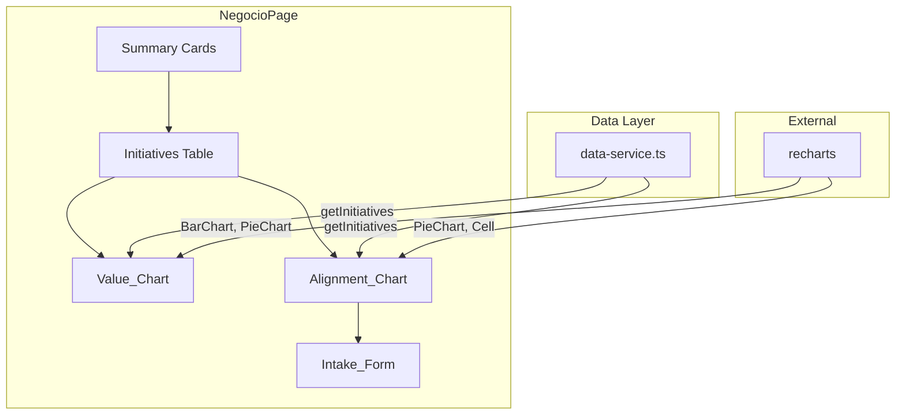

# Design Document: Negocio Value Realization

## Overview

Este diseño amplía el módulo de Negocio (`NegocioPage.tsx`) con tres componentes nuevos que se renderizan debajo del contenido existente (tarjetas resumen + tabla de iniciativas):

1. **Value_Chart** — Gráfico de barras agrupadas (Recharts `BarChart`) que compara el valor proyectado vs. el valor real por iniciativa, con barras de "Realidad" coloreadas dinámicamente según el Fulfillment Ratio.
2. **Alignment_Chart** — Gráfico de dona (Recharts `PieChart`) que muestra el porcentaje de esfuerzo alineado a OKRs vs. no alineado, con etiqueta central de porcentaje.
3. **Intake_Form** — Formulario controlado de React con validación en línea para registrar nuevas iniciativas, usando clases sb-ui para inputs y alertas.

La fuente de datos es el `data-service.ts` existente (síncrono, mock). La librería de gráficos seleccionada es **recharts** con versión exacta pinned (`2.12.7`). No se introduce estado global ni side-effects; el formulario opera localmente con `useState`.

## Architecture



### Decisiones Arquitectónicas

| Decisión | Justificación |
|----------|---------------|
| Recharts como librería de gráficos | Librería React-first, composable, tipada, ligera (~45KB gzipped). Compatible con React 18.3. Alternativa react-chartjs-2 requiere Chart.js como peer dependency adicional. |
| Versión exacta `2.12.7` | Cumple la política de pinned versions del proyecto (sin `^` ni `~`). |
| Componentes colocados en `src/pages/negocio/` | Mantiene la estructura flat existente del proyecto — cada página es una carpeta. |
| Lógica de cálculo inline en componentes | El data-service es síncrono y los cálculos son simples (sumas, ratios). No se justifica una capa adicional de transformación. |
| Formulario sin persistencia real | El requisito solo pide mostrar confirmación y resetear. No hay endpoint ni mutación del mock-data. |

## Components and Interfaces

### ValueChart Component

```typescript
// src/pages/negocio/ValueChart.tsx
interface ValueChartProps {
  initiatives: Initiative[];
}

// Internal helper
function getFulfillmentColor(projected: number, actual: number): string;
// Returns: "green" | "amber" | "red" based on ratio thresholds
```

**Responsabilidades:**
- Recibe un arreglo de `Initiative[]`
- Calcula el Fulfillment Ratio por iniciativa
- Renderiza un `BarChart` con dos `Bar` (Promesa, Realidad)
- Aplica color condicional a la barra "Realidad" usando Recharts `Cell`
- Trunca nombres de iniciativa a 20 chars con ellipsis
- Muestra tooltip personalizado con nombre, valor formateado y ratio
- Muestra estado vacío si `initiatives.length === 0`

### AlignmentChart Component

```typescript
// src/pages/negocio/AlignmentChart.tsx
interface AlignmentChartProps {
  initiatives: Initiative[];
}

interface AlignmentData {
  name: string;
  value: number;
  color: string;
}
```

**Responsabilidades:**
- Calcula el Strategic Alignment Index: `(sum projectedValue where status != "en_riesgo") / (sum all projectedValue) * 100`
- Renderiza un `PieChart` con `Pie` (innerRadius/outerRadius para dona)
- Muestra etiqueta central con porcentaje
- Usa color primario sb-ui para segmento alineado, gris para no alineado
- Muestra tooltip con porcentaje a un decimal

### IntakeForm Component

```typescript
// src/pages/negocio/IntakeForm.tsx
interface IntakeFormState {
  name: string;
  kpi: string;
  expectedValue: string;
}

interface ValidationErrors {
  name?: string;
  kpi?: string;
  expectedValue?: string;
}
```

**Responsabilidades:**
- Formulario controlado con `useState` para campos y errores
- Validación on-submit: campos no vacíos, no solo whitespace, valor numérico positivo en rango
- Muestra mensajes de error inline debajo de cada campo
- Al éxito: muestra `sb-ui-alert` de confirmación y resetea campos
- Usa clases sb-ui para inputs (`sb-ui-input`, `sb-ui-btn`)

### NegocioPage Integration

Se modifica `NegocioPage.tsx` para importar y renderizar los tres componentes nuevos debajo del contenido existente, envueltos en el grid responsivo apropiado.

```typescript
// Adición al final del JSX de NegocioPage
<div className="grid grid-cols-1 md:grid-cols-2 gap-6">
  <article className="sb-ui-card sb-ui-card--elevated">
    <div className="sb-ui-card__content">
      <h3 className="sb-ui-heading-h6 mb-4">Valor Prometido vs. Realizado</h3>
      <ValueChart initiatives={initiatives} />
    </div>
  </article>
  <article className="sb-ui-card sb-ui-card--elevated">
    <div className="sb-ui-card__content">
      <h3 className="sb-ui-heading-h6 mb-4">Alineación Estratégica</h3>
      <AlignmentChart initiatives={initiatives} />
    </div>
  </article>
</div>
<article className="sb-ui-card sb-ui-card--elevated">
  <div className="sb-ui-card__content">
    <h3 className="sb-ui-heading-h6 mb-4">Registrar Nueva Iniciativa</h3>
    <IntakeForm />
  </div>
</article>
```

## Data Models

### Existing Types (unchanged)

```typescript
interface Initiative {
  id: string;
  name: string;
  teamId: string;
  projectedValue: number;   // millones COP
  actualValue: number;      // millones COP
  status: "en_progreso" | "completada" | "en_riesgo";
}
```

### Derived Data Structures

```typescript
// For ValueChart internal use
interface ChartInitiativeData {
  name: string;            // truncated to 20 chars
  fullName: string;        // original name for tooltip
  projectedValue: number;
  actualValue: number;
  fulfillmentRatio: number; // 0-100+ (percentage)
  fulfillmentColor: string; // "#00A651" | "#FFC107" | "#DC3545"
}

// For AlignmentChart internal use
interface AlignmentSegment {
  name: string;       // "Esfuerzo alineado a OKRs" | "Esfuerzo no alineado"
  value: number;      // projected value sum for this segment
  percentage: number; // calculated percentage
  color: string;      // primary color or gray
}

// For IntakeForm
interface IntakeFormState {
  name: string;
  kpi: string;
  expectedValue: string;   // string for controlled input, parsed to number on submit
}
```

### Fulfillment Ratio Calculation

```
fulfillmentRatio = projectedValue === 0 
  ? 0 
  : (actualValue / projectedValue) * 100
```

### Color Thresholds

| Rango | Color | Hex |
|-------|-------|-----|
| ≥ 90% | Verde | `#00A651` (bolivar-green) |
| 70%–89% | Ámbar | `#FFC107` (bolivar-yellow) |
| < 70% | Rojo | `#DC3545` |

### Strategic Alignment Index Calculation

```
alignedValue = sum(i.projectedValue) where i.status in ["completada", "en_progreso"]
totalValue = sum(i.projectedValue) for all initiatives
alignmentIndex = totalValue === 0 ? 0 : (alignedValue / totalValue) * 100
```

### Intake Form Validation Rules

| Campo | Regla | Mensaje de Error |
|-------|-------|-----------------|
| Nombre | non-empty, trimmed, max 100 chars | "El nombre de la iniciativa es obligatorio" / "Máximo 100 caracteres" |
| KPI | non-empty, trimmed, max 150 chars | "El KPI asociado es obligatorio" / "Máximo 150 caracteres" |
| Valor Esperado | numeric, > 0, ≤ 999999.99, max 2 decimals | "Ingrese un valor numérico positivo entre 0.01 y 999,999.99" |


## Correctness Properties

*A property is a characteristic or behavior that should hold true across all valid executions of a system—essentially, a formal statement about what the system should do. Properties serve as the bridge between human-readable specifications and machine-verifiable correctness guarantees.*

### Property 1: Name Truncation Preserves Short Names and Clips Long Ones

*For any* string `s`, if `s.length <= 20` then `truncateName(s) === s`, and if `s.length > 20` then `truncateName(s)` has exactly 20 characters and ends with "…" (ellipsis), and the first 17 characters match the first 17 characters of `s`.

**Validates: Requirements 1.1**

### Property 2: Fulfillment Color Matches Threshold Rules

*For any* pair of non-negative numbers `(projectedValue, actualValue)`:
- If `projectedValue === 0`, the color is red
- If `(actualValue / projectedValue) * 100 >= 90`, the color is green
- If `(actualValue / projectedValue) * 100` is in `[70, 90)`, the color is amber
- If `(actualValue / projectedValue) * 100 < 70`, the color is red

**Validates: Requirements 1.4, 1.5, 1.6, 1.10**

### Property 3: Strategic Alignment Index Calculation

*For any* array of initiatives with non-negative `projectedValue` fields and valid `status` values, the alignment index equals `(sum of projectedValue where status is "completada" or "en_progreso") / (sum of all projectedValue) * 100`, rounded to the nearest integer. If the total sum is zero, the index is 0.

**Validates: Requirements 2.2, 2.4, 2.6**

### Property 4: Text Field Validation Accepts Non-Empty Trimmed Strings Within Max Length

*For any* string `s` and max length `maxLen`: the validation returns valid if and only if `s.trim().length >= 1` AND `s.trim().length <= maxLen`. Strings composed entirely of whitespace are always rejected.

**Validates: Requirements 3.2, 3.3, 3.5**

### Property 5: Numeric Value Validation Accepts Only Positive Numbers in Range With Max 2 Decimals

*For any* input value `v`: the validation returns valid if and only if `v` is a number, `v >= 0.01`, `v <= 999999.99`, and `v` has at most 2 decimal places. All other inputs (non-numeric strings, negative numbers, zero, out-of-range, more than 2 decimals) are rejected.

**Validates: Requirements 3.4, 3.6**

### Property 6: Monetary Value Formatting

*For any* non-negative number `n`, the formatted string `formatCurrency(n)` matches the pattern `$X,XXXM` where the numeric portion uses comma thousands separators and represents the input value as an integer.

**Validates: Requirements 1.8, 5.1**

### Property 7: Valid Form Submission Resets All Fields

*For any* combination of valid inputs (name: non-empty trimmed ≤100 chars, kpi: non-empty trimmed ≤150 chars, value: positive number in range), after successful submission, all form fields return to their default empty state ("", "", "").

**Validates: Requirements 3.7**

## Error Handling

### Value_Chart

| Escenario | Comportamiento |
|-----------|---------------|
| `initiatives` vacío | Renderiza mensaje "No hay datos de iniciativas disponibles" en lugar del gráfico |
| `projectedValue === 0` | Trata Fulfillment Ratio como 0%, colorea barra en rojo |
| Nombres largos (>20 chars) | Trunca con ellipsis en eje X, tooltip muestra nombre completo |

### Alignment_Chart

| Escenario | Comportamiento |
|-----------|---------------|
| Sin iniciativas | Muestra dona con 0% de alineación y etiqueta "0%" |
| Todas las iniciativas "en_riesgo" | Muestra 0% alineado, 100% no alineado |
| Ninguna iniciativa "en_riesgo" | Muestra 100% alineado, 0% no alineado |

### Intake_Form

| Escenario | Comportamiento |
|-----------|---------------|
| Campo vacío o solo whitespace | Mensaje inline: "Este campo es obligatorio" |
| Nombre > 100 chars | Mensaje inline: "Máximo 100 caracteres" |
| KPI > 150 chars | Mensaje inline: "Máximo 150 caracteres" |
| Valor no numérico | Mensaje inline: "Ingrese un valor numérico positivo entre 0.01 y 999,999.99" |
| Valor ≤ 0 o > 999,999.99 | Mensaje inline: "Ingrese un valor numérico positivo entre 0.01 y 999,999.99" |
| Valor con más de 2 decimales | Mensaje inline: "Máximo 2 decimales permitidos" |
| Envío exitoso | `sb-ui-alert` success, campos reseteados |

## Testing Strategy

### Unit Tests (Example-based)

- **ValueChart rendering:** Verifica que se renderizan 2 barras por iniciativa, leyenda presente, ejes con formato correcto.
- **AlignmentChart rendering:** Verifica 2 segmentos de dona, etiqueta central, colores correctos.
- **IntakeForm rendering:** Verifica título, campos con labels, clases sb-ui aplicadas.
- **Empty state:** ValueChart con array vacío muestra mensaje, AlignmentChart muestra "0%".
- **Layout integration:** Cards con clases correctas, grid responsivo con clases Tailwind.

### Property-Based Tests (Recharts logic + validation)

**Library:** `fast-check` (versión exacta `3.19.0`) — librería PBT madura para TypeScript/JavaScript.

**Configuration:** Mínimo 100 iteraciones por propiedad.

| Property | Test Tag |
|----------|----------|
| Property 1: Name Truncation | `Feature: negocio-value-realization, Property 1: Name truncation preserves short names and clips long ones` |
| Property 2: Fulfillment Color | `Feature: negocio-value-realization, Property 2: Fulfillment color matches threshold rules` |
| Property 3: Alignment Index | `Feature: negocio-value-realization, Property 3: Strategic alignment index calculation` |
| Property 4: Text Validation | `Feature: negocio-value-realization, Property 4: Text field validation accepts non-empty trimmed strings within max length` |
| Property 5: Numeric Validation | `Feature: negocio-value-realization, Property 5: Numeric value validation accepts only positive numbers in range with max 2 decimals` |
| Property 6: Currency Format | `Feature: negocio-value-realization, Property 6: Monetary value formatting` |
| Property 7: Form Reset | `Feature: negocio-value-realization, Property 7: Valid form submission resets all fields` |

### Test Runner

- **Framework:** Vitest (compatible con Vite del proyecto, sin instalación adicional si se agrega como devDependency pinned)
- **PBT Library:** `fast-check` 3.19.0
- **Component Testing:** `@testing-library/react` para renderizado y assertions de DOM

### Approach

- Extraer funciones puras (`truncateName`, `getFulfillmentColor`, `calculateAlignmentIndex`, `validateTextField`, `validateNumericField`, `formatCurrency`) como utilidades testables independientemente del componente React.
- Las propiedades 1-6 se testean directamente contra las funciones puras (sin DOM).
- La propiedad 7 requiere renderizado del componente para verificar el reset del estado.
- Los unit tests example-based cubren la integración visual y las interacciones de Recharts.
