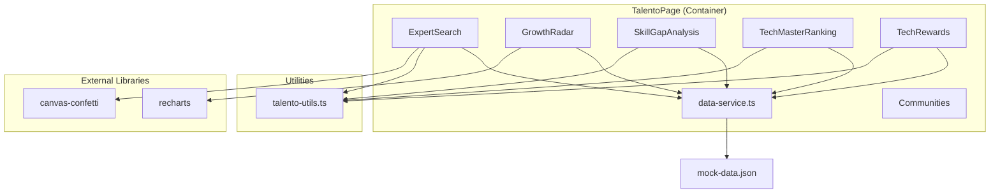

# Design Document: Talento Module

## Overview

El Módulo Talento es una página completa gamificada dentro de la Engineering Intelligence Platform que acelera el desarrollo de carrera y capacidades técnicas. Reemplaza la implementación actual de `TalentoPage` (tabla de skills + kudos) con seis secciones interactivas: Buscador de Expertos, Radar de Crecimiento, Skill Gap Analysis, Ranking TechMaster, Tech Rewards y Comunidades.

La arquitectura sigue el patrón existente del proyecto: componentes React funcionales con TypeScript, datos provenientes de `data-service.ts` (sin backend real), estilización con Tailwind CSS + clases sb-ui, e iconografía con lucide-react. Se añaden dos dependencias: `recharts` para gráficos de radar y `canvas-confetti` para animaciones de celebración.

### Design Decisions

1. **Componentes separados por sección**: Cada una de las 6 secciones se implementa como un componente independiente dentro de `src/pages/talento/components/`, facilitando mantenimiento y testing.
2. **Lógica de cálculo extraída**: Las funciones de cálculo puro (filtrado, índice de madurez, clasificación DORA, análisis de brechas) se extraen a un archivo `src/pages/talento/talento-utils.ts` para facilitar el testing unitario y property-based testing.
3. **Estado local con useState**: No se necesita estado global. Cada sección gestiona su propio estado (búsqueda, membresías, solicitudes de mentoría).
4. **Mock data extendido**: Se añade `previousLeadTimeForChanges` al tipo `Team` y al mock data para habilitar el cálculo de mejora en Tech Rewards.
5. **canvas-confetti importado dinámicamente**: Para evitar impacto en el bundle size inicial, se puede importar con `import()` dinámico al hacer clic.

## Architecture



### Data Flow

1. `TalentoPage` es el componente contenedor que importa los 6 sub-componentes.
2. Cada sub-componente llama a `data-service.ts` para obtener datos crudos.
3. La lógica de transformación/cálculo se delega a funciones puras en `talento-utils.ts`.
4. El estado de UI (búsqueda, botones deshabilitados, membresías) es local a cada componente.
5. No hay comunicación lateral entre secciones.

## Components and Interfaces

### Component Hierarchy

```
TalentoPage
├── ExpertSearch
│   └── ExpertCard
├── GrowthRadar
├── SkillGapAnalysis
├── TechMasterRanking
├── TechRewards
│   └── TeamRewardCard
└── Communities
    └── CommunityCard
```

### Component Props & Responsibilities

```typescript
// ExpertSearch - Manages search state, renders filtered ExpertCards
// No props - fetches data internally
interface ExpertSearchState {
  searchTerm: string;
  mentorshipRequested: Set<string>; // Set of userId
}

// ExpertCard
interface ExpertCardProps {
  user: User;
  teamName: string;
  matchingSkills: Skill[];
  onRequestMentorship: (userId: string) => void;
  mentorshipRequested: boolean;
}

// GrowthRadar - Displays radar chart for current user (first user in array)
// No props - fetches current user internally

// SkillGapAnalysis - Computes and displays skill gaps
// No props - fetches all users internally

// TechMasterRanking - Computes and displays leaderboard
// No props - fetches all users internally

// TechRewards - Computes DORA-based team badges
// No props - fetches all teams internally

// TeamRewardCard
interface TeamRewardCardProps {
  team: Team;
  hasBadge: boolean;
  improvementPercentage: number | null;
  eliteMetricsCount: number;
  metricLevels: MetricLevel[];
}

// Communities - Displays community cards with join functionality
// No props - uses hardcoded community data
interface CommunityCardProps {
  name: string;
  members: number;
  type: 'techmaster' | 'techlovers';
  joined: boolean;
  onJoin: () => void;
}
```

### Utility Functions (`talento-utils.ts`)

```typescript
// Expert Search
export function filterUsersBySkill(users: User[], searchTerm: string): User[];
export function getMatchingSkills(user: User, searchTerm: string): Skill[];

// Skill Gap Analysis
export interface SkillAnalysis {
  name: string;
  demand: number;        // number of users with this skill
  averageLevel: number;  // average level across users
  gap: number;           // 5 - averageLevel
}
export function analyzeSkills(users: User[]): SkillAnalysis[];

// TechMaster Ranking
export interface RankedUser {
  user: User;
  index: number;       // maturity index (avg of skill levels)
  position: number;    // rank position
  isTechMaster: boolean; // has at least one skill at level 5
}
export function computeRanking(users: User[]): RankedUser[];
export function computeMaturityIndex(user: User): number;

// Tech Rewards
export type MetricLevelLabel = 'Elite' | 'Alto' | 'Necesita mejora';
export interface MetricLevel {
  metric: string;
  value: number;
  label: MetricLevelLabel;
  isElite: boolean;
}
export function classifyMetricLevel(metric: keyof DoraMetrics, value: number): MetricLevelLabel;
export function isEliteDORA(metrics: DoraMetrics): boolean;
export function computeLeadTimeImprovement(current: number, previous: number): number;
export function computeEliteProgress(metrics: DoraMetrics): number; // 0, 25, 50, 75, or 100
export function hasTeamBadge(team: Team): boolean;

// Color utilities
export function getGapColor(averageLevel: number): 'green' | 'yellow' | 'red';
```

## Data Models

### Extended Types (additions to `src/types/index.ts`)

```typescript
// Extend Team interface to include previousLeadTimeForChanges
export interface Team {
  id: string;
  name: string;
  wipLimit: number;
  wipCurrent: number;
  doraMetrics: DoraMetrics;
  memberMood: MemberMood[];
  previousLeadTimeForChanges?: number; // New field - previous quarter lead time in days
}
```

### Mock Data Extensions

Add `previousLeadTimeForChanges` to each team in `mock-data.json`:

```json
{
  "teams": [
    {
      "id": "team-openfinance",
      "previousLeadTimeForChanges": 6.5,
      "...": "existing fields"
    },
    {
      "id": "team-siniestros",
      "previousLeadTimeForChanges": 15.0,
      "...": "existing fields"
    },
    {
      "id": "team-emision",
      "previousLeadTimeForChanges": 9.0,
      "...": "existing fields"
    }
  ]
}
```

### Community Data (hardcoded in component)

```typescript
const COMMUNITIES = [
  { id: 'community-1', name: 'TechLovers AI', members: 128, type: 'techlovers' as const },
  { id: 'community-2', name: 'TechMaster Frontend', members: 95, type: 'techmaster' as const },
  { id: 'community-3', name: 'TechLovers Cloud', members: 64, type: 'techlovers' as const },
];
```

### DORA Elite Thresholds (constants)

```typescript
export const DORA_ELITE_THRESHOLDS = {
  deploymentFrequency: 10,   // >= 10 deploys/week
  leadTimeForChanges: 5,     // <= 5 days
  changeFailureRate: 10,     // <= 10%
  mttr: 2,                   // <= 2 hours
} as const;

export const DORA_HIGH_THRESHOLDS = {
  deploymentFrequency: 8,    // >= 8 (within 20% of elite)
  leadTimeForChanges: 6,     // <= 6 (within 20% of elite)
  changeFailureRate: 12,     // <= 12% (within 20% of elite)
  mttr: 2.4,                 // <= 2.4 (within 20% of elite)
} as const;
```

## Correctness Properties

*A property is a characteristic or behavior that should hold true across all valid executions of a system — essentially, a formal statement about what the system should do. Properties serve as the bridge between human-readable specifications and machine-verifiable correctness guarantees.*

### Property 1: Expert search filter correctness

*For any* non-empty search string and any set of users with skills, the filter function SHALL return only users who possess at least one skill whose name contains the search string as a case-insensitive substring, and SHALL include ALL such users from the input set.

**Validates: Requirements 1.2**

### Property 2: Expert card rendering completeness

*For any* user with N skills (where N >= 0), the rendered expert card SHALL display the user's name, role, resolved team name (or "Equipo no asignado" if team not found), and at most 10 skills each formatted as "skillName (level/5)".

**Validates: Requirements 1.5, 2.1, 2.3, 2.5, 2.6**

### Property 3: Radar data series correctness

*For any* user with a non-empty skills array, the radar chart data SHALL contain one entry per skill where the "Nivel Actual" value equals the skill's level and the "Nivel Deseado" value equals 5.

**Validates: Requirements 3.2, 3.3**

### Property 4: Skill analysis computation correctness

*For any* set of users with skills, the skill analysis function SHALL produce one entry per unique skill name where `demand` equals the count of users possessing that skill, and `averageLevel` equals the arithmetic mean of that skill's levels across all users who possess it.

**Validates: Requirements 4.2**

### Property 5: Skill demand ordering

*For any* non-empty skill analysis result, the "most demanded" list SHALL be ordered such that each skill's demand count is greater than or equal to the demand count of the next skill in the list.

**Validates: Requirements 4.3**

### Property 6: Skill gap ordering

*For any* non-empty skill analysis result, the "highest gap" list SHALL be ordered such that each skill's gap (5 - averageLevel) is greater than or equal to the gap of the next skill in the list.

**Validates: Requirements 4.4**

### Property 7: Skill gap color classification

*For any* skill with a computed average level, the color SHALL be green if averageLevel >= 4, yellow/amber if averageLevel >= 3 and < 4, and red if averageLevel < 3.

**Validates: Requirements 4.5**

### Property 8: Technical Maturity Index calculation

*For any* user with N skills (where N > 0), the Technical Maturity Index SHALL equal the arithmetic mean of all skill levels rounded to 1 decimal place. For a user with 0 skills, the index SHALL be 0.

**Validates: Requirements 5.2, 5.9**

### Property 9: Ranking sort with tie-breaking

*For any* set of users, the ranking SHALL be sorted in descending order of Technical Maturity Index, and users with identical indices SHALL share the same position number and be sorted alphabetically by name.

**Validates: Requirements 5.3, 5.4, 5.8**

### Property 10: TechMaster badge assignment

*For any* user, the TechMaster badge SHALL be displayed if and only if the user possesses at least one skill with level equal to 5.

**Validates: Requirements 5.5**

### Property 11: Lead Time improvement badge award

*For any* team with both `leadTimeForChanges` and `previousLeadTimeForChanges` defined, the Badge_Equipo_TechMaster SHALL be awarded by improvement criterion if and only if `((previousLeadTimeForChanges - leadTimeForChanges) / previousLeadTimeForChanges) * 100 >= 20`.

**Validates: Requirements 8.2**

### Property 12: Elite DORA badge award

*For any* team, the Badge_Equipo_TechMaster SHALL be awarded by elite criterion if and only if `deploymentFrequency >= 10` AND `leadTimeForChanges <= 5` AND `changeFailureRate <= 10` AND `mttr <= 2`.

**Validates: Requirements 8.3**

### Property 13: DORA metric level classification

*For any* individual DORA metric value, the classification SHALL be "Elite" if it meets the elite threshold, "Alto" if it's within 20% of the elite threshold without meeting it, and "Necesita mejora" otherwise. Specifically: for deploymentFrequency, Elite >= 10, Alto >= 8; for leadTimeForChanges, Elite <= 5, Alto <= 6; for changeFailureRate, Elite <= 10, Alto <= 12; for mttr, Elite <= 2, Alto <= 2.4.

**Validates: Requirements 8.6**

### Property 14: DORA elite progress percentage

*For any* team that does not qualify for Badge_Equipo_TechMaster, the progress percentage SHALL equal (number of individual metrics meeting elite threshold / 4) * 100, yielding one of: 0%, 25%, 50%, 75%.

**Validates: Requirements 8.12**

### Property 15: Team card ordering

*For any* set of teams, the Tech Rewards section SHALL display teams with Badge_Equipo_TechMaster first, followed by teams without the badge ordered by descending elite progress percentage.

**Validates: Requirements 8.13**

## Error Handling

| Scenario | Handling |
|----------|----------|
| User has empty skills array | GrowthRadar shows "No hay datos de skills disponibles" message; Ranking assigns index 0 |
| Team not found by `getTeamById` | ExpertCard shows "Equipo no asignado" |
| No users match search term | ExpertSearch shows "No se encontraron expertos para '{term}'" message |
| No skills exist in any user | SkillGapAnalysis shows "No hay datos de skills disponibles para analizar" |
| Team missing `previousLeadTimeForChanges` | TechRewards shows "Sin datos históricos" and skips 20% improvement check |
| `canvas-confetti` fails to load | Gracefully catch error, still show toast success message |
| Division by zero in average calculation | Guard against N=0 users for a skill (should not occur given data, but return 0) |

## Testing Strategy

### Unit Tests (Example-Based)

Unit tests cover specific examples, edge cases, UI rendering, and integration points:

- **ExpertSearch**: Empty search shows all users; specific search term returns expected users; no-match shows message
- **ExpertCard**: Renders with/without team; renders with 0, 3, and 15 skills (verifies max 10 cap); mentorship button state transitions
- **GrowthRadar**: Renders chart with user data; shows message for empty skills
- **SkillGapAnalysis**: Renders with mock data; shows message when no skills
- **TechMasterRanking**: Renders leaderboard; verifies top-3 podium styling; verifies badge display
- **TechRewards**: Renders team cards; verifies badge criteria; verifies "Sin datos históricos" for missing field
- **Communities**: Renders 3 cards in order; join/unjoin state transitions; state reset on remount
- **Confetti integration**: Mock canvas-confetti, verify it's called on mentorship click

### Property-Based Tests

Property-based tests verify universal correctness properties using **fast-check** (JavaScript property-based testing library).

Each property test:
- Runs minimum 100 iterations
- References its design document property with a tag comment
- Tests pure utility functions from `talento-utils.ts`

**Properties to test:**
1. Filter correctness (Property 1)
2. Skill analysis computation (Property 4)
3. Skill demand ordering (Property 5)
4. Skill gap ordering (Property 6)
5. Gap color classification (Property 7)
6. Maturity Index calculation (Property 8)
7. Ranking sort with tie-breaking (Property 9)
8. TechMaster badge assignment (Property 10)
9. Lead Time improvement badge (Property 11)
10. Elite DORA badge (Property 12)
11. DORA metric classification (Property 13)
12. DORA elite progress (Property 14)
13. Team card ordering (Property 15)

**Tag format:** `// Feature: talento-module, Property {N}: {title}`

**Configuration:** fast-check with `{ numRuns: 100 }` per property.

### Test Setup

- **Test runner**: Vitest (compatible with Vite project)
- **Testing library**: @testing-library/react for component tests
- **PBT library**: fast-check for property-based tests
- **Mocking**: vi.mock for canvas-confetti, data-service when needed
